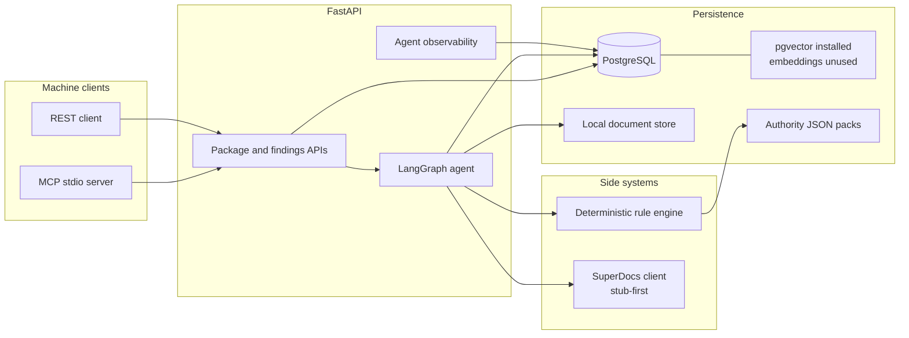
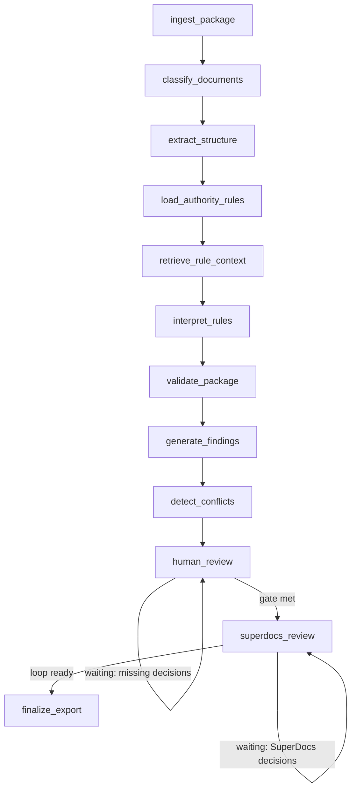

# Architecture (one page)

Pre-submission filing validator as implemented. A UI is not in this system. Machines drive the flow over REST or MCP.

## System

## Agent stages that actually run

Completed stages are checkpointed in Postgres and skipped on resume. `human_review` and SuperDocs wait per item. Export does not run if those gates are unmet.

## Honest boundaries

| Piece | What it is | What it is not |
|-------|------------|----------------|
| Classification / extract | Filename and stored metadata | PDF/section/signature/date parsing |
| Rule retrieval | Deterministic indexed lookup | Vector/semantic search |
| Validation | Config-driven engine | Authority `if` branches or invented PASS |
| SuperDocs | upload / chat / approve / export, stub in tests | Proven live production API |
| Observability | Stage status, duration, retries, failures | Measured LLM token cost |
| Frontend | None | React review UI |

Rendered visuals for evaluators:

- One-pager poster: [`docs/architecture.png`](docs/architecture.png)
- Exact Mermaid renders: [`docs/architecture-system.png`](docs/architecture-system.png), [`docs/architecture-stages.png`](docs/architecture-stages.png)
